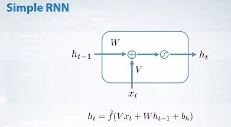
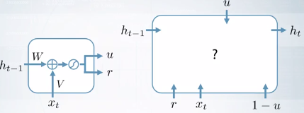
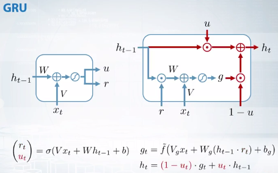

## Motivation for recurrent layers

> Question 1

How many weights are there in the first layer of the MLP? Do not forget about the bias vector!

hidden neurons: 100

window width: 100

word embeddings size: 100

- 10 100

- 10 000

- __1 000 100__

__There are 100*100 inputs to the first layer of the MLP: 100 elements for each word in the window. Therefore the weight matrix contains 1M parameters. Additionally, the bias vector contains 100 parameters.__

- 1 000 000

> Question 2

How many weights are there in the first layer of the MLP? Do not forget about the bias vector.

hidden neurons: 100

word embeddings size: 100

we transfer hidden neurons of the first layer between time steps

- __20 100__

__There are 200 inputs to the first layer of the MLP: 100 from the current input and 100 from the previous hidden state. Therefore the weight matrix contains 200*100 parameters. Additionally, the bias vector contains 100 parameters.__

- 10 100

- 10 200

- 20 200

Takeaways:

## Simple RNN and Backpropagation

> Note:

All weights are shared across time steps

## The training of RNN

### To train an RNN we need to backprop through layers and time

__The more steps between the time moments k and t, the more elements are in this product__

> Gradient Vanishing and Exploding !!

- Values of these Jacobian matrices have particularly severe impact on the contribution from faraway steps

## Dealing with vanishing and exploding gradients

### Gradient Exploding

### Gradient Vanishing

> How can we deal with gradient vanishing and exploding?

- LSTM, GRU
- RELU activation function
- Initialization of the recurrent weight matrix
- Skip connections

#### Property of orthogonal matrix

So no matter how many times we perform repeated matrix multiplication, the resulting matrix does not explode or vanish.

- Initialize W with an orthogonal matrix
- Use orthogonal W through the whole training

----

In this way the second part of the Jacobian doesn't cause the vanishing gradient problem, at least on the first iterations of the training.

__In this case, the network has a chance to find long range dependencies in the data.__

----

There are some approaches that utilize the properties of orthogonal matrices, not just for a proper initialization, but also for the parameterization of the weights for the whole training process.

----
__Takeaways:__

- Exploding gradients are easy to detect but it is not clear how to detect vanishing gradients
- Exploding gradients: 
    - gradient clipping 
    - truncated BPTT
- Vanishing gradients:
    - ReLU nonlinearity
    - orthogonal initialization of the recurrent weights
    - skip connection

## Modern RNNs: LSTM

When we do a back-prop on such layer, __gradient needs to go through non-linearity__ and __for multiplication by weight matrix W__, both can cause `gradient vanishing`

### So the main idea is to create a short way for the gradients result any non-linearities or multiplications.

- All sorts of LSTM propose to do it by adding a new separately way through recurrent layer --> __Interal memory C__ (__which other layers on the network do not have access to__)

- At each step of LSTM, we compute not only the vector of hidden units H but also a vector of memory c on the same dimension

As the result, we have two ways through such layer:

- one between $H_{t-1}$ and $H_t$
- second between the memory cells $C_{t-1}$ and $C_t$

### For the Gates, we use only the sigmoid non-linearity

It is important because we want the elements on the gates to take values from 0 to 1

- value 1 --> open gate
- value 0 --> close gate

So if we multiply some info by the gate vector, we either get the same info or zero or some value in between

- the input gate controls what to store in the memory
- the __information vector__ g is multiplied by the input gate and then added to the memory
- the output gate controld what to read from the memory and return to the outer 

- memory cell c are multiplied by the output gate and then returned as a new hidden units

> How does help with the gradient vanishing problem?

__There's not only one way through the recurrent layer __

And the important thing is there is at least one short way for the information and for the gradients between memory cells $C_{t-1}$ and $C_t$. There is no any non-linearity or multiplication on this way.

So if we calculate the Jacobian of $C_t$ with respect to $C_{t-1}$, __it's equal to 1!! So there's no vanishing problem anymore__

Memory C has faint capacities so the values will be a mess after a lot of time steps. We need to be able to erase the cache info from memory from time to time, and  the __forget gate__ will help us do it, especially with long sequences.

Forget gate is very important to long sequences, because of which we now have multiplication on the short way through the LSTM. 

So if we compute the Jacobian of $C_t$ with respect to $C_{t-1}$, it is equal to $F_t$ now (not 1) and the Forget Gate $F_t$ takes values from 0 to 1. So it is usually less than one and may cause vanishing gradient problem

To do this, the proper initialization could be used.

If the base of the forget gate is __initialized with high positive numbers, then the forget gate at first iteration with training is almost equal to one__

__At the beginning, LSTM doesn't forget and can't find long range dependencies in the data. And later it learns to forget if it's necessary__

### Intuition about how LSTM behave in practice 

Because of these different regimes, LSTM can work with the information more accurately, for example, when the simple RNN read something from data, it outputs the info at each time step and gradually forgets it each time. At the same situation, LSTM can carry the info much longer from time and outputs it only in the particular time steps

> Takeaways:

- LSTM has a lot of advantages compared with the simple RNN 
- __but LSTM has 4 times more parameters because each gate and the info left in g has its own set of parameters V, W and b__
- which make LSTM less efficient in terms of memory and time and also makes the GRU architecture more likely 

## GRU

The GRU layer doesn't contain an additional internal memory, but it also contains two gates that are called the reset and update gates.
- these gates are computed in the same manner as the ones from LSTM so they're equal to the sigmoid function or the linear combination of the inputs.
    - as a result, they can take queries from 0 to 1
- there's other gate controls which part of the hidden units from the previous time step we use as an input to the information vector g
    - it acts quite similar to an input gate in the LSTM. 

- The update gate controls the balance between the storing the previous values of the hidden units and  the writing the new info into hidden units __so it works as a combination of inputs and forget gates from the LSTM__

The gradient vanishing problem in GRU is very similar to the one in LSTM. 

__Here we have a short way layer with only one multiplication by the update gate. The short way is actually an identity keep connection from $H_{t-1}$ to $H_t$__

> Question: 

__We should initialize the base vector on the update gate with some high positive numbers, so that in the beginning of the training, the gradients go through these multiplications very easy and network is capable to find long range dependencies in the data__

but we should not use not too high numbers here, since if the update gate is open, then the GRU layer does not pay much attention to the inputs X.

### Rule of thumb

### Or use a multi-layer RNN so we can stack several recurrent layers

